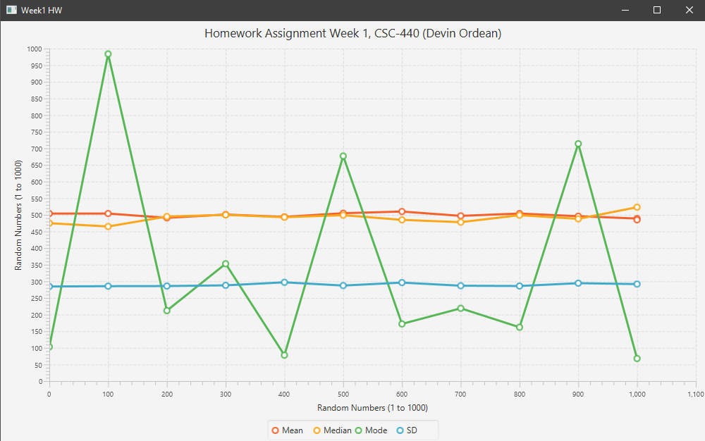

# LineChart
Chart mean, median, mode, and standard deviation in a JavaFX line chart.
This was a homework assignment at National University (Advanced Programming in Java).
This was my first line chart experience in JavaFX. Rather easy.

